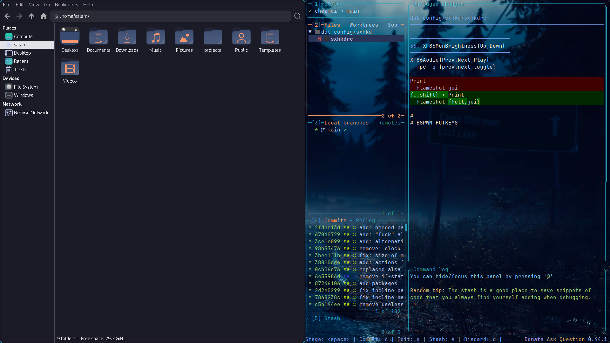
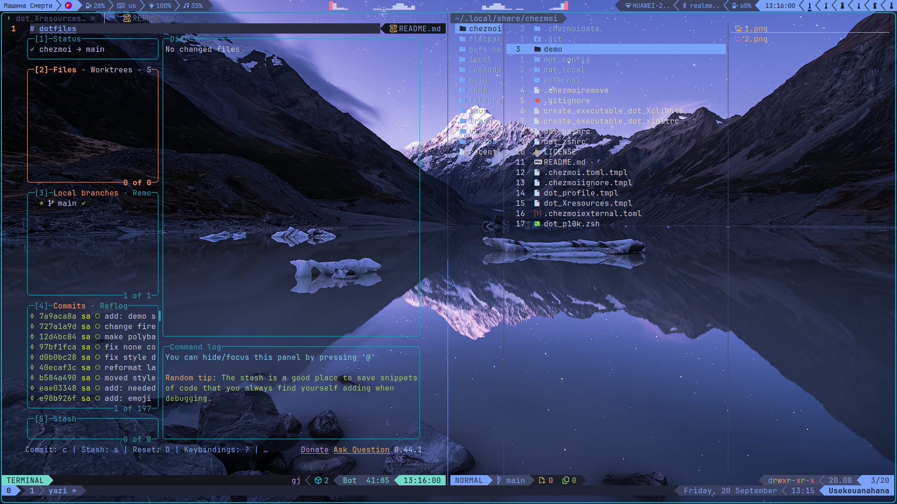
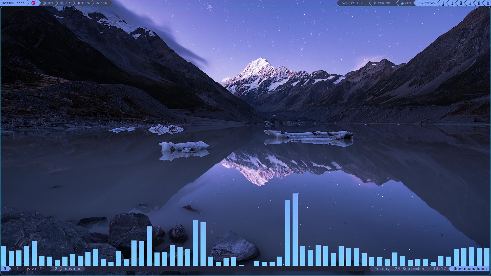

# :gear: dotfiles

This [dotfiles](https://github.com/salam99823/dotfiles) repository is managed with [`chezmoi`](https://www.chezmoi.io/), a great dotfiles manager.

## :blue_book: About

- OS: [**`Arch Linux`**](https://archlinux.org/)
- Terminal: [**`Alacritty`**](https://github.com/alacritty/alacritty)
- Shell: [**`Zsh`**](https://github.com/ohmyzsh/ohmyzsh/wiki/Installing-ZSH)
- Editor: [**`Neovim`**](https://github.com/neovim/neovim)

## Wayland

- WM: [**`Sway`**](https://github.com/swaywm/sway)
- Compositor: [**`Sway`**](https://github.com/swaywm/sway)
- Bar: [**`Waybar`**](https://github.com/Alexays/Waybar)
- App Launcher: [**`Rofi`**](https://github.com/lbonn/rofi)
- Notify Daemon: [**`Mako`**](https://github.com/emersion/mako)

### :key: HotKeys

- Open the terminal - `super + enter`
- Close the window that is in focus - `super + shift + q`
- Open the application menu - `super + d` | `alt + space`
- Set a random wallpaper - `alt + w`
- Toggle bar - `super + shift + b`
- Switch the layout - `capslock`
- Take a screenshot - `print screen`
- Switch to another desktop - `super + 0..=9`
- Move the window to another desktop - `super + shift + 0..=9`
- Reload Sway - `super + shift + c`

The other hotkeys are in `~/.config/sway/modes/default`.

## X11

- WM: [**`bspwm`**](https://github.com/baskerville/bspwm)
- Compositor: [**`Picom`**](https://github.com/yshui/picom)
- Bar: [**`Polybar`**](https://github.com/polybar/polybar)
- App Launcher: [**`Rofi`**](https://github.com/davatorium/rofi)
- Notify Daemon: [**`Dunst`**](https://github.com/dunst-project/dunst)

### :key: HotKeys

- Open the terminal - `super + enter`
- Launch tmux - `super + shift + t`
- Close the window that is in focus - `super + shift + q`
- Open the application menu - `super + d`
- Open the command menu - `super + shift + d`
- Set a random wallpaper - `super + alt + w`
- Toggle bar - `super + shift + b`
- Switch the layout - `super + shift + c`
- Take a screenshot - `shift + print screen`
- Switch to another desktop - `super + 1..=6`
- Move the window to another desktop - `super + shift + 1..=6`
- Reload `bspwm` - `super + shift + u`
- Restart `sxhkd` - `super + u`

The other hotkeys are in `~/.config/sxhkd/sxhkdrc`.

## :framed_picture: Gallery

