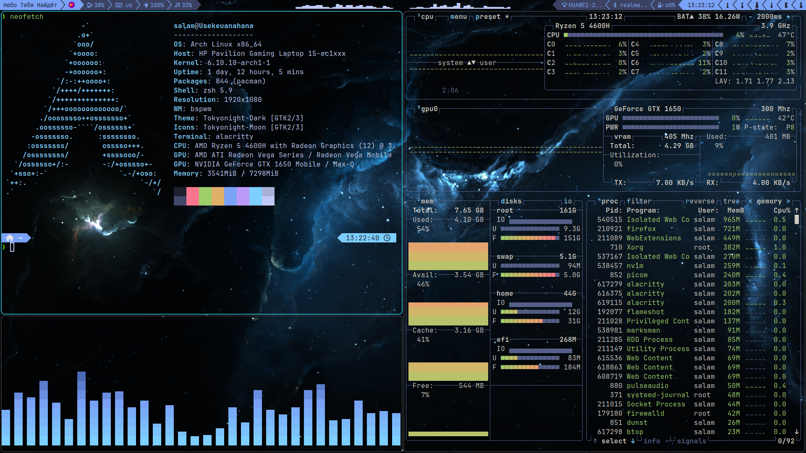

# :gear: dotfiles

This [dotfiles](https://github.com/salam99823/dotfiles) repository is managed with [`chezmoi`](https://www.chezmoi.io/), a great dotfiles manager.

## :blue_book: About

- OS: [**`Arch Linux`**](https://archlinux.org/)
- WM: [**`BSPWM`**](https://github.com/baskerville/bspwm)
- Bar: [**`Polybar`**](https://github.com/polybar/polybar)
- Compositor: [**`Picom`**](https://github.com/yshui/picom)
- Terminal: [**`Alacritty`**](https://github.com/alacritty/alacritty)
- App Launcher: [**`Rofi`**](https://github.com/davatorium/rofi)
- Notify Daemon: [**`Dunst`**](https://github.com/dunst-project/dunst)
- Shell: [**`Zsh`**](https://github.com/ohmyzsh/ohmyzsh/wiki/Installing-ZSH)
- Editor: [**`Neovim`**](https://github.com/neovim/neovim)

## :key: HotKeys

- Open the terminal - `super + t`
- Launch tmux - `super + shift + t`
- Set a random wallpaper - `super + shift + w`
- Switch the layout - `super + shift + c`
- Open the application menu - `super + space`
- Open the command menu - `super + shift + space`
- Open the browser in incognito mode - `super + shift + f`
- Recognize the color on the screen - `super + x`
- Close the window that is in focus - `super + d`
- Take a screenshot - `shift + print`
- Restart bspwm - `super + shift + u`
- Restart sxhkd - `super + u`
- Toggle polybar - `super + p`
- Switch to another desktop - `super + 1/6`
- Move the window to another desktop - `super + shift + 1/6`
- Switch the window to floating mode - `super + alt + f`

The other hotkeys are in `~/.config/sxhkd/sxhkdrc`.

## :framed_picture: Gallery

